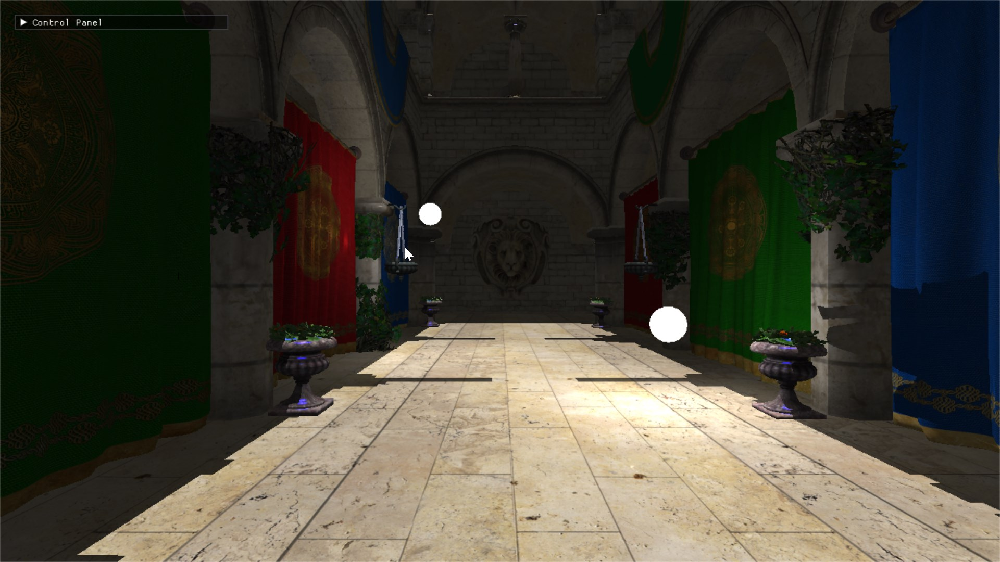
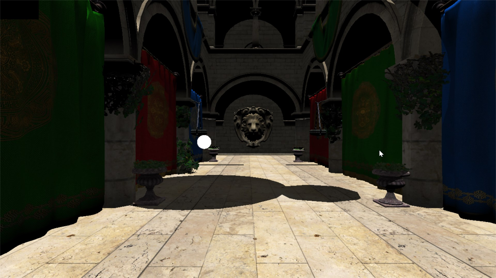

Personal game engine written in C++ using DirectX11. 

## Notable Features
 - Immediate Mode GUI
 - Rendering:
	- Forward Render
	- Deferred Render
	- Shadow Mapping
	
Forward Render

Deferred Render

## Dependencies
 - Assimp - https://github.com/assimp/assimp
 - DirectXTex - https://github.com/microsoft/DirectXTex
