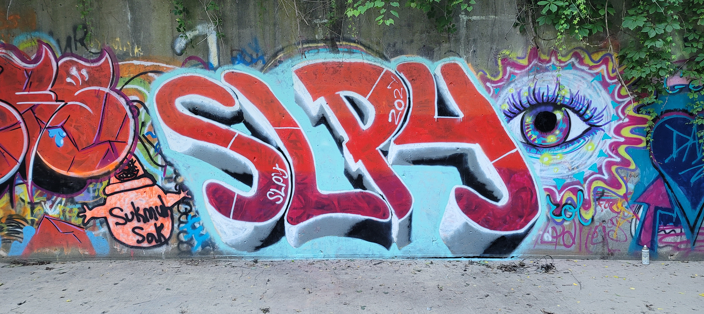
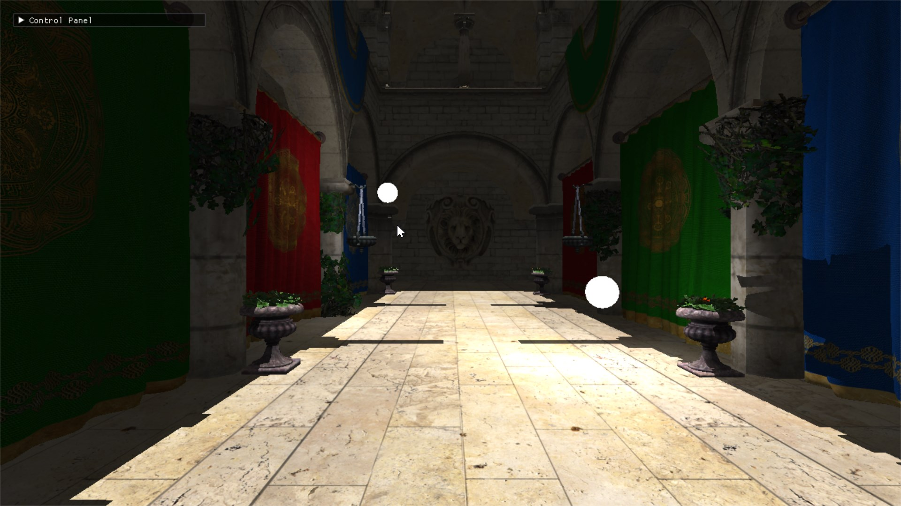

Personal game engine written in C++ using DirectX11. 

## Notable Features
I have extended chili's hw3d engine in the following ways:
		- Spot Light w/ Shadows
		- Directional Light w/ Shadows
		- Deferred Rendering Rendergraph
		- Dynamic Vertex/Pixel Shader reloading

	
Forward Render

Deferred Render

## Dependencies
 - Assimp - https://github.com/assimp/assimp
 - DirectXTex - https://github.com/microsoft/DirectXTex
 - ImGUI - https://github.com/ocornut/imgui
